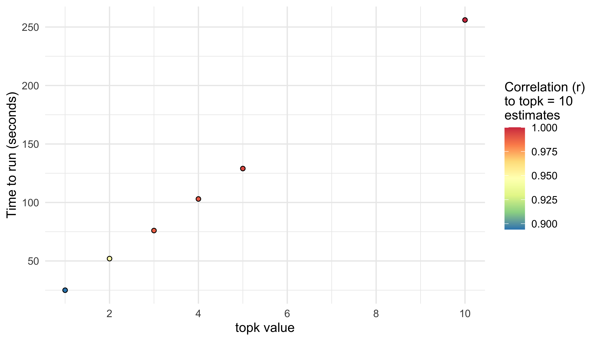

# Accessibility indicators at UPRN level
Mark Green (methodology) & Roberto Villegas-Diaz (visualisations)

<!-- This report was rendered using Quarto, to make changes, please edit the .qmd file and NOT the .md -->

## Introduction

The methods presented here estimate the road network accessibility
between origin locations (households in our case) and sites of interest
(e.g., green spaces). A key metric developed using this methodology is
the time/distance of a household to its nearest green space, although it
can be easily adapted for any particular environmental feature (e.g.,
replacing green spaces with General Practice locations or retail
outlets) or region/country. All of the data and methods used are open
source.

The code and methods started life as version 3 of the [Access to Healthy
Assets and Hazards](https://github.com/ESRC-CDRC/ahah) resource and
later refined in the [UK routes](https://github.com/cjber/ukroutes)
resource. A lot of credit therefore should be given to [Cillian
Berragan](https://github.com/cjber) for leading on the development of
these resources which underpin the methodology presented here.

## Data

There are three key sources of information required:

### 1. Road network

The [Ordnance Survey Open
Roads](https://www.ordnancesurvey.co.uk/products/os-open-roads) resource
was used to act as the network to estimate the accessibility between
origins and destinations (data downloaded on 4th June 2024). The
resource is vector file containing the entire road network for Great
Britain, including information about the nature of a road (e.g., speed
limit, type of road). The resource is set up to represent lines and
nodes (connections between different lines, such as junctions). While we
could have used Open Street Map data here, we have found that this
resource has more accurate road speed networks.

The resource does not include routes available via ferries which can be
an important transport network when living on a remote island
(especially for Scotland, although less relevant for Cheshire and
Merseyside here). Ferry routes were accessed from [Open Street
Map](http://overpass-turbo.eu/?q=LyoKVGhpcyBoYcSGYmVlbiBnxI1lcmF0ZWQgYnkgdGhlIG92xJJwxIlzLXR1cmJvIHdpemFyZC7EgsSdxJ9yaWdpbmFsIHNlxLBjaMSsxIk6CsOiwoDCnHJvdcSVPWbEknJ5xYjCnQoqLwpbxYx0Ompzb25dW3RpbWXFmzoyNV07Ci8vxI_ElMSdciByZXN1bHRzCigKICDFryBxdcSSxJrEo3J0IGZvcjogxYjFisWbZcWPxZHFk8KAxZXGgG5vZGVbIsWLxY1lIj0ixZByxZIiXSh7e2LEqnh9fSnFrcaAd2F5xp_GocSVxqTGpsaWxqrGrMauxrDGssa0xb_FtWVsxJRpxaDGusaTxr3Gp8apxqvGrcavb8axxrPFrceFxoJwxLduxorFtsW4xbrFvMWbxJjGnHnFrT7Frcejc2vHiMaDdDs&c=BH1aTWQmgG).

The road network files are stored in `data/raw/oproad`.

### 2. Origins

The origin locations are our inputs for which we want to estimate the
nearest distance/time to an object of interest. In our code here, the
interest is on households which we define using the Unique Property
Reference Number (UPRN). UPRNs are unique identifiers for all unique
properties across Great Britain. Data were downloaded on 4th June 2024
using the [Ordnance Survey Open UPRN
product](https://www.ordnancesurvey.co.uk/products/os-open-uprn).
<!-- [Office for National Statistic’s open UPRN directory](https://geoportal.statistics.gov.uk/datasets/acd0dbf73c2849f2a45e15c4aa248805/about). The resource is based on Ordnance Survey’s ‘AddressBase’ data product and includes a list of all UPRNs and their geographical location (Geographic Reference System: OSGB 1936, 27700). -->

The population of interest for our metric is Cheshire and Merseyside. An
additional [ONS lookup
table](https://geoportal.statistics.gov.uk/datasets/02d709e510804d67b16068b037cd72e6/about)
linked to each UPRN was used to subset only UPRNs that fall within the
Local Authorities of Cheshire and Merseyside (Chester and Cheshire East,
Cheshire West, Halton, Knowsley, Liverpool, Sefton, St. Helens,
Warrington and Wirral). If you wanted to recreate our indicators for a
different region, one would have change this step in the code.

The methods described below are computationally intensive and the
density of UPRNs bring their own challenges (especially compared to
postcodes). To improve the time spent processing UPRNs, we initially
compute the metrics for [Topographic
Identifiers](https://www.ordnancesurvey.co.uk/products/os-open-toid)
(TOIDs) rather than UPRNs. UPRNs are nested within TOIDs, since UPRNs
will give each unique property and TOIDs give the unique building. For
example, a tower block or student halls accomodation will have many
UPRNs for the same TOID/building (e.g., Crown Place student halls at the
University of Liverpool (UK) has ~1200 UPRNs for a single TOID). Through
using TOIDs, we reduce the number of computations on the assumption that
they will be similar for all UPRNs (note: there will be some small
differences where TOIDs have multiple entrances, but the differences
should be negligible here). The result is that using TOIDs gives us a
dataset which is 23% smaller than if we use UPRNs only. In the workflow
described below, we first estimate each indicator for TOIDs within
Cheshire and Merseyside (using the datasets described above), then link
the TOID values back to UPRNs using an [Ordnance Survey lookup
table](https://www.ordnancesurvey.co.uk/products/os-open-linked-identifiers).
If you are using the code for smaller regions of UPRNS, then you may not
need to do this.

Files are stored in the folder `data/raw/onspd`.

### 3. Destinations

Destinations refers to the specific features of interest that we are
interested in estimating the nearest distance/time to for each origin.
The data described here are therefore flexible to the specific indicator
one wants to create. As such, this section will be updated as and when
new accessibility indicators are created.

#### 3a. Green space

[Ordnance Survey’s Open Green Space
Layer](https://www.ordnancesurvey.co.uk/products/os-open-greenspace)
resource was used to capture the locations of green spaces. The resource
covers Great Britain, although we subset only green spaces for Cheshire
and Merseyside in our analysis here.

The routing algorithm described below expects point locations. We
therefore use the access points of each green space when estimating
accessibility. Access points are the specific locations in which
individuals can enter a green space (e.g., gate, road entry point). The
resource also includes polygons of the spatial extent of each green
space. Using these polygons, the size of each green space is calculated.
We follow Geary et al. (2023) definitions of green space types for
inclusion of the functional types of green space.

While the Ordnance Survey includes access points for each green space
vector, they can be of mixed quality (e.g., missing access points or
lack of informal routes that people may also use). To counter this, we
follow the methodology outlined in Geary et al. (2023). Here we process
the access points in `ukroutes/process_input_files.R` to select the
north, south, east and west extents of the spatial boundaries of each
green space. These are then added to the Ordnance Survey’s access points
to supplement them.

The open green space layer does not include open access land which are
found in rural areas (i.e., field and farmland with right of ways
through them). We accessed their spatial extents via [Natural England’s
open data
resource](https://naturalengland-defra.opendata.arcgis.com/datasets/6ce15f2cd06c4536983d315694dad16b/explore?location=53.419183%2C-2.773053%2C10.73).
This follows the methodology set out by Natural England in their Green
Infrastructure project. Since the files only include the spatial extent
and do not include the specific access points, we process each row to
estimate the north, south, east and west points to mimic this (using the
same approach as described above).

Files are stored in the folder `data/raw/osgsl`.

## Methods

The core methodology involves estimating the Single Source Shortest Path
(SSSP) algorithm for every TOID. We have found since developing the
Access to Healthy Assets and Hazards resource that computing road
network accessibility measures is computationally intensive. We have
improved this methodology through using the GPU accelerated Python
library `cugraph`, part of the [NVIDIA RAPIDS
ecosystem](https://rapids.ai/). `cugraph` allows for the highly
parallellised processing of graph networks. This has significantly
reduced the computational time from days to hours or minutes (depending
on the size of the dataset). Cillian Berragan has written a brief
[methodology description
here](https://github.com/cjber/ukroutes?tab=readme-ov-file#routing-methodology),
on their UK routes tool which supplements the text below.

To run the code, you will need access to GPU support (the larger, the
better). If you do not have access to a GPU, then you can use the
jupyter notebook in this repository to run the code on [Google
Colab](https://colab.research.google.com/) which can provide you with
free access to cloud GPU support (see `access_indicators_colab.ipynb`).
It takes roughly one hour to run the notebook using the premium Colab
option and after the roads have been pre-processed (this only needs to
be done once, so it is therefore one hour per indicator). The notebook
includes how to set up Google Colab to run the repo.

The specific details of how the methods work were divided into two
stages:

### 1. Preprocessing

The first step is to wrangle the raw input data into the necessary
formats for estimating the routing paths. There are two key files that
you will need to run separately:

#### 1a. Road network

The file `ukroutes/preprocessing.py` processes the road network into a
graph network and estimates the time taken inbetween the segments of the
road network (edges).

1.  `process_road_edges`: The function reads road link data and
    calculates time estimates for road segments based on the speed
    estimates included in the dataset (estimated based on road
    classification and form). The speed estimates (in km/h) are
    converted to time estimates (in minutes) based on the length of each
    road segment. The processed data is returned as a *Polars DataFrame*
    containing the start and end nodes, time estimates, and lengths of
    the road segments.
2.  `process_road_nodes`: The function processes road node data,
    extracting the easting and northing coordinates from the geometry of
    the nodes. It returns a *Polars DataFrame* with the node IDs and
    their coordinates.
3.  `ferry_routes`: The function takes ferry routes data and links each
    ferry node with the nearest road nodes using a *K-D Tree* for
    efficient nearest-neighbour queries. The function calculates time
    estimates for ferry edges based on their lengths and a fixed speed
    estimate. The processed ferry nodes and edges are returned as
    *Polars DataFrames*.
4.  `process_os`: This function orchestrates the overall processing
    workflow through processing the input data using the three functions
    described above. The nodes are re-indexed to ensure unique
    identifiers, and the final nodes and edges DataFrames are saved to
    `.parquet` files for efficient storage and retrieval.

The code will process the entire road network for Great Britain. While
we could have subset the network for just Cheshire and Merseyside to
save time, it is not too long to do Great Britain as a whole so we left
it as that for now. The resulting processed road network is stored in
the folder `data/processed/oproads`.

> **Note**
>
> The file only needs processing once and it can then be used for any
> additional indicator generation.

#### 1b. Origins

The file `ukroutes/process_input_toids.R` processes all origin datasets
into the format that they are required for being used in the routing
calculations. It loads in all TOIDs for Great Britain and subsets only
those located in Cheshire and Merseyside. The resulting processed TOID
files are stored in the folder `data/processed`.

#### 1c. Destinations

The file `ukroutes/process_input_greensp.R` processes all the green
space datasets and combines them into a single file. It loads in the
Ordnance Survey’s open green space layer (both access points and their
spatial boundaries) and the open access land spatial boundaries.
Locations in Cheshire and Merseyside are then subset for each of these
(we take a 2km buffer around the border to minimise any edge effect
issues where the nearest green space is located just across the
administrative border). The access points require minimal wrangling to
get into the necessary format, although they are linked to the size of
their corresponding green space. The two spatial boundaries are then
processed to estimate the north, south, east and west points of their
spatial extents to approximate further access points, as per the Geary
et al. (2023)
[methodology](https://www.journalslibrary.nihr.ac.uk/phr/LQPT9410/#/app3).
To do this, we calculate a bounding box around each green space and then
extract the most northerly, southerly, easterly and westerly points.
These are then converted into the required formats for capturing their
point location.

The file recreates the following indicators based on Natural England’s
2023 Green Infrastructure Framework definitions (see p33 of their [Green
infrastructure standards
report](https://designatedsites.naturalengland.org.uk/GreenInfrastructure/downloads/Green%20Infrastructure%20Standards%20for%20England%20Summary%20v1.1.pdf)):

1.  **Doorstop green space** - minimum size 0.5 ha, maximum distance 200
    m, maximum journey time 5 minutes (walk).
2.  **Local green space** - minimum size 2 ha, maximum distance 300 m,
    maximum journey time 5 minutes (walk).
3.  **Neighbourhood green space** - minimum size 10 ha, maximum distance
    1 km, maximum journey time 15 minutes (walk).
4.  **Wider green space** - minimum size 20 ha, maximum distance 2 km,
    maximum journey time 35 minutes (walk).
5.  **District ogreen space** - minimum size 100 ha, maximum distance 5
    km, maximum journey time 15-20 minutes (cycle).
6.  **Sub-regional green space** - minimum size 500 ha, maximum distance
    10 km, maximum journey time 30-40 minutes (cycle).
7.  **All green space** - consider all green space of any size

The processed green space indicators for each of these definitions are
stored in `data/processed/osgsl`.

### 2. Estimate routing

The next set of files estimate the accessibility indicators.

#### 2a. Key files doing the processing ‘under the hood’

The files described below are the key files which calculate the access
between origin and destination datasets. One does not need to run these
files, since they are mostly called or incoporated into the scripts for
generated each indicator. A description of each file is provided below
to help explain what they do.

The file `ukroutes/routing.py` does the following:

1.  `__init__`: Define key parameters. Creates a `cuGraph` graph object
    (`cuGraph` allows for GPU-accelerated data processing) from the
    provided edges, setting it up with the specified time weights.
    Initialises an empty DataFrame for distances.
2.  `fit`: Calculates the shortest distances for each destination point.
3.  `create_sub_graph`: Generates a subgraph based on a buffer distance
    around each TOID. Copies nodes and calculates the distance of each
    node from the TOID. Creates a subgraph with nodes within the buffer
    distance, doubling the buffer size until a valid subgraph is created
    or the maximum buffer size is reached. Removes partial graphs (i.e.,
    parts of the network that not connected to the road network, as this
    creates inefficient or erroneous calculations) and ensures the
    subgraph contains all necessary nodes.
4.  `_remove_partial_graphs`: Identifies and retains the largest
    connected component in a subgraph.
5.  `get_shortest_dists`: Creates a subgraph for the given TOID.
    Calculates shortest paths within the subgraph using Single Source
    Shortest Path (SSSP) and filters unreachable nodes. Determines
    distances based on the length of the inputs and outputs DataFrames.
    Updates the distances DataFrame with the shortest distances for each
    node. Determines which DataFrame to process based on their lengths.
    Iterates over the items in the selected DataFrame and calls the
    `get_shortest_dists` method for each item.

The file `ukroutes/process_routing.py` does the following:

1.  `add_to_graph`: The function adds new nodes and edges to an existing
    graph. To do this, it first uses `KDTree` to find the k nearest
    nodes for each point in a data frame with new nodes. Then creates a
    DataFrame `nearest_nodes_df` to store these nearest nodes and their
    distances. Constructs new edges from the new nodes to their nearest
    nodes, calculates a time-weighted distance, and adds these edges to
    the edges DataFrame.
2.  `add_topk`: The function finds the top k nearest nodes in input for
    each node in output and updates buffers. Again a `KDTree` is used to
    find the k nearest nodes for each point in output. If the output is
    smaller than input, it updates the output with the nearest nodes and
    their buffers. If the output is not smaller, it constructs a
    DataFrame to associate each output node with its top k nearest nodes
    from input. Then update the input DataFrame with lists of nearest
    nodes and calculate buffers. Merge these results with the input
    DataFrame and ensures only valid lists are kept.

> **Note**
>
> These files are instrumental in part 2b.

#### 2b. Files that you need to run

The files located in the folder `scripts` contain each self-contained
scripts for creating each individual indicator. Once you have processed
all of the input files, you just need to run each script file
individually to create your own set of estimates for TOIDs for that
particular indicator. Within the folder, there lies the following files:

- `gs_all_routing`: Estimates the time (minutes) or distance (meters) to
  the nearest green space of any size for all TOIDs.

The list of files will be updated with the addition of each new
indicator.

Each file does roughly the following:

1.  Reads in the origins (e.g., TOIDs) and destination (e.g., green
    spaces) datasets. Loads in the pre-processed road network nodes and
    edges, and converts them to `cuDF` DataFrames for GPU processing.
2.  The `filter_deadends` function constructs a graph using the loaded
    edges, identifies connected components, and filters out nodes and
    edges that are not part of the largest connected component. This
    step ensures the graph is contiguous and removes isolated nodes and
    edges.
3.  The `add_to_graph` function is used to integrate the origin and
    destination data into the graph, updating the nodes and edges
    accordingly. The `add_topk` function is applied to rank and filter
    the greenspace and postcode data based on proximity to help the
    efficiency of the computational time.
4.  A routing object is instantiated with the processed nodes, edges,
    greenspace areas (as inputs) and TOIDs (as outputs). The routing
    object is configured with parameters such as weights (time
    estimates) and buffer distances. The fit method of the routing
    object calculates distances between nodes in the graph based on the
    given weights and buffers.
5.  The computed distances are joined with the origin data to associate
    each distance with a specific origin (e.g., TOID). The resulting
    DataFrame, containing origins and nearest distance to a destination,
    is saved to a CSV file.

Once the file has been processed, please then run the file
`ukroutes/process_output_toids.R` which will match the TOID values back
to UPRNs.

#### 2c. Tips and advice on running scripts

Each individual script can be modified to alter the performance of the
code. The following metrics can be changed:

1.  `add_to_graph`: The function will find the k nearest nodes for each
    origin (TOID) and create a graph based on the edges from these.
    Having more nodes makes sure that you find the shortest path by
    considering more routings. If you want to save on computational
    time, we suggest using a value of 1 or 2 (smaller values save time).
2.  `add_topk`: The function will find the nearest k nodes in the origin
    (TOID) DataFrame for each point in the destination (greenspace)
    DataFrame. This means that for each node in greenspace, the function
    will identify the k closest nodes in TOIDs based on their spatial
    coordinates.
3.  Buffer size (`min_buffer` and `max_buffer` values): The values
    control the size of the area around each point for which the
    subgraph is created and to ensure that nodes are sufficiently
    captured. A higher minimum value will make sure that you capture
    enough nodes (and destinations / green spaces) to calculate routes,
    but may increase computational time by potentially capturing more
    than needed. A larger maximum buffer size will increase the area
    considered - most important when analysing fewer destinations or
    those with a greater spatial coverage (e.g., UK whole rather than
    regional).
4.  `cutoff`: Maximum time to estimate distance for and if estimates are
    above this, then stop estimating and save as maximum value (helps to
    save time where large distances and sparse destinations). Either
    comment out the code or set to ‘None’ if want to estimate without a
    maximum cut off point.

By adjusting the k values in `add_to_graph` and `add_topk`, you control
how many nearest neighbors are considered in both functions, affecting
the connectivity and detail of the resulting graph and nearest neighbor
relationships.

We tested changes in `add_topk` using 100 TOIDs and all green spaces
(undertaken on Google Colab). Each 1 unit increase scales the time
increase linearly, but smaller values may give incorrect estimates
(i.e., where the nearest node was not actually the shortest path to a
destination). Having a topk set at 10 is likely best practice, but to
reduce computational time a topk value of 3 still gives excellent
outcomes with only incremental improvements thereafter. See table below
for results:

| topk value | Correlation (r) to topk = 10 estimates | Time to run (seconds) |
|------------|----------------------------------------|-----------------------|
| 1          | 0.894                                  | 25                    |
| 2          | 0.950                                  | 52                    |
| 3          | 0.988                                  | 76                    |
| 4          | 0.990                                  | 103                   |
| 5          | 0.993                                  | 129                   |
| 10         | 1.000                                  | 256                   |

#### 2d. Time or distance indicators

One can measure either the shortest distance (meters) or time (minutes)
from a household to any indicator of interest (e.g., nearest green
space). Both time and distance are highly correlated together (r = 0.95
in a sample of 100 TOIDs), as they are essentially the same thing (i.e.,
the further something is located away from you, the longer it will take
to get there - although we note that travelling at the speed limit for 1
minute on a 70mph motorway versus a 20mph road will give different
distances, demonstrating how the road network shapes access). If you
want to change the output to record time or distance, please change the
weight in the `Routing()` function to either “time_weighted” for time or
“length” for distance (see the files within part 2b).

## Examples of usage

Through estimating the accessibility of each household to their nearest
green space, one can investigate how the living closer or far from these
spaces influences human activity (e.g., physical activity), health and
wellbeing outcomes. This can help us to generate evidence on the
importance of building or maintaining natural environments.

## Visualisations

The following are some example visualisations of the greenspace
indicators.

##### Distance to any greenspace

> consider all green space of any size.

##### Distance to doorstep greenspace

> minimum size 0.5 ha, maximum distance 200 m, maximum journey time 5
> minutes (walk).

## References

Geary, R.S., Thompson, D.A., Garrett, J.K., Mizen, A., Rowney, F.M.,
Song, J., White, M.P., Lovell, R., Watkins, A., Lyons, R.A., Williams,
S., Stratton, G., Akbari, A., Parker, S.C., Nieuwenhuijsen, M.J., White,
J., Wheeler, B.W., Fry, R., Tsimpida, D., Rodgers, S.E., 2023.
[Green–blue space exposure changes and impact on individual-level
well-being and mental health: A population-wide dynamic longitudinal
panel study with linked survey data](https://doi.org/10.3310/lqpt9410).
Public Health Research 1–176.

